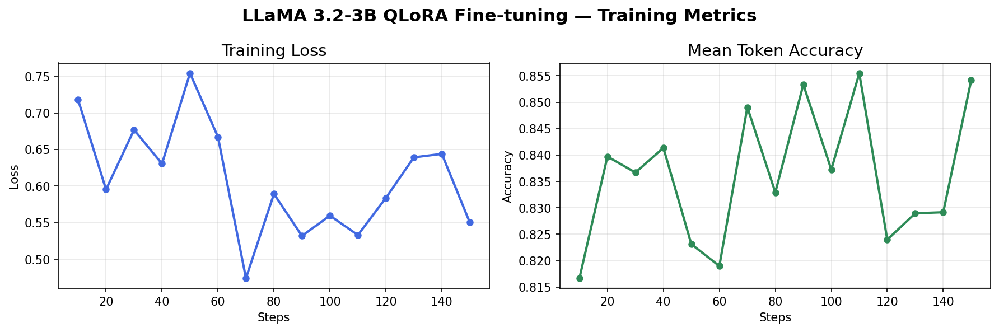

# LLaMA 3.2-3B Supervised Fine-Tuning (SFT) on Python Code Instructions

## Overview
This project demonstrates Supervised Fine-Tuning (SFT) of Meta's LLaMA 3.2-3B model on a Python code instruction dataset using QLoRA (Quantized Low-Rank Adaptation). The goal is to improve the model's ability to follow coding instructions and generate correct Python code.

## Hardware
- **GPU:** NVIDIA GeForce RTX 3060 (12GB VRAM)
- **CUDA:** 12.2
- **Driver:** 535.274.02

## Technique: QLoRA

Full fine-tuning of a 3B parameter model requires ~48GB+ VRAM. To understand why, during training the GPU must store 4 things simultaneously for every parameter:

| What | Precision | Size for 3B params |
|---|---|---|
| Model weights | float16 | 6GB |
| Gradients | float16 | 6GB |
| Optimizer states (Adam m) | float32 | 12GB |
| Optimizer states (Adam v) | float32 | 12GB |
| Activations (batch) | float16 | ~4-8GB |
| **Total** | | **~40-48GB** |

We use the Adam optimizer which tracks two extra values per parameter (m and v), both in float32 (4 bytes each): 3B × 4 bytes × 2 = 24GB just for optimizer states alone.

QLoRA makes this feasible on a single consumer GPU by combining two techniques:

- **4-bit Quantization (bitsandbytes):** Compresses model weights from 16-bit to 4-bit, reducing VRAM from ~6GB to ~2GB. The weights are not lost — all 3 billion parameters are still there, just compressed into a smaller representation (similar to JPEG vs RAW). Each weight goes from 16 possible bits of precision down to 4 bits (16 possible values). Neural networks are surprisingly robust to this precision loss because the relative relationships between weights matter more than their exact values.

- **LoRA (Low-Rank Adaptation):** Instead of updating all 3B parameters, small trainable adapter matrices are added to the attention and MLP layers. Only 12M parameters (0.37%) are actually trained. These adapters are kept in full precision (bfloat16) intentionally — because gradient updates during training are extremely small numbers that would vanish completely if rounded to 4-bit. The base model stays frozen in 4-bit while the adapters capture the fine-tuning signal accurately.

The result:
- Base model: ~2GB VRAM in 4-bit (vs 40-48GB for full fine-tuning)
- LoRA adapter weights: ~24MB on disk
- LoRA adapters during training (weights + gradients): ~48MB
- Total training VRAM: fits comfortably within 12GB

In a datacenter setting with NVIDIA A100/H100 GPUs (80GB VRAM), full fine-tuning or 16-bit training with DeepSpeed ZeRO-3 would be preferred for higher quality results.

### Understanding LoRA Parameter Count

LLaMA 3.2-3B consists of 28 identical layers, each containing 7 weight matrices:

- **Attention block:** q_proj, k_proj, v_proj, o_proj
- **MLP block:** gate_proj, up_proj, down_proj

That's 7 × 28 = **196 weight matrices** in total. Each matrix has a hidden dimension of 4096, so each is of size (4096 × 4096) = 16M parameters. This gives us roughly 16M × 7 × 28 ≈ **3.1B parameters** for the whole model.

Instead of updating these 196 large matrices directly, LoRA adds two small matrices alongside each one:

```text
Original:  4096 × 4096  = 16M params  ← FROZEN
LoRA A:    4096 × 8     = 32K params  ← trainable
LoRA B:    8    × 4096  = 32K params  ← trainable
```

The total trainable parameters are:

```text
2 × 4096 × 8 × 196 = ~12.8M params = 0.37% of 3.2B
```

During the forward pass, both the original and LoRA paths run simultaneously, and their outputs are added together. During backpropagation, gradients flow through both paths but only A and B get updated — the original matrix W is frozen.

At the start of training, B is initialized to zeros so the model behaves exactly like the original LLaMA — training starts from a stable point and gradually learns the delta.

### Forward and Backward Pass

During the **forward pass**, both paths run simultaneously and their outputs are added:

```text
                    ┌─────────────────────┐
                    │  W (4096×4096)      │  FROZEN
input (4096) ──────►│                     ├──────► output A (4096)
                    └─────────────────────┘              │
                                                         +  ──► final output (4096)
                    ┌──────────┐ ┌──────────┐            │
                    │A (4096×8)│ │B (8×4096)│  TRAINABLE │
input (4096) ──────►│          ├►│          ├──────► output B (4096)
                    └──────────┘ └──────────┘
```

During the **backward pass**, gradients flow through both paths but only A and B get updated — W is frozen:

```text
gradient
  │
  ├──► tries to update W ──► BLOCKED (requires_grad=False)
  │
  └──► updates A and B ──► ✅ gradients flow, weights updated
```

## Dataset
- **Name:** `iamtarun/python_code_instructions_18k_alpaca`
- **Size:** 18,612 samples
- **Format:** Alpaca instruction format (`instruction`, `input`, `output`)

## Dataset Examples

The dataset follows the Alpaca instruction format with three fields: `instruction`, `input`, and `output`. These are formatted into `prompt` and `completion` pairs for training:

**Example 1:**
```text
PROMPT:
### Instruction:
Create a function to calculate the sum of a sequence of integers.

### Input:
[1, 2, 3, 4, 5]

### Response:

COMPLETION:
def sum_sequence(sequence):
  sum = 0
  for num in sequence:
    sum += num
  return sum
```

**Example 2:**
```text
PROMPT:
### Instruction:
Generate a Python code for crawling a website for a specific type of data.

### Input:
website: www.example.com
data to crawl: phone numbers

### Response:

COMPLETION:
import requests
import re

def crawl_website_for_phone_numbers(website):
    response = requests.get(website)
    phone_numbers = re.findall('\d{3}-\d{3}-\d{4}', response.text)
    return phone_numbers
```

**Example 3:**
```text
PROMPT:
### Instruction:
Create a Python list comprehension to get the squared values of a list [1, 2, 3, 5, 8, 13].

### Input:

### Response:

COMPLETION:
[x*x for x in [1, 2, 3, 5, 8, 13]]
```

## Results

### Training Metrics
| Metric | Value |
|---|---|
| Trainable parameters | 12,156,928 (0.37%) |
| Total parameters | 3,224,906,752 |
| Training steps | 100 |
| Final loss | 0.56 |
| Training time | 4m 44s |

### Loss and Accuracy



## Before vs After SFT

The base model treats prompts as autocomplete — it describes what the function should do instead of writing it. After SFT on 18k Python examples, the model correctly follows the instruction format and generates working code.

### Prompt 1: Reverse a string

**Base model:**
```text
Write a Python function that reverses a string. The inputstring is given as first argument.
The output should be the reversed string.
# Test case 1:
assert reverse("hello") == "olleh"
```

**Fine-tuned model:**
```python
def reverse_string(string):
    return ''.join(reversed(list(string)))

# Test case
string = 'hello'
print(reverse_string(string)) # Output: olleh
```

---

### Prompt 2: Check if a number is prime

**Base model:**
```text
A prime number is a natural number greater than 1 and not divisible by any other
whole numbers except itself and 1. The first few primes are: 2,3,5,7,11,13…
Note – This problem has been taken from HackerRank's "Python Primer for Beginners"
```

**Fine-tuned model:**
```python
def check_prime(n):
    for i in range(2, n//2+1): 
        if n % i == 0: return False
```

---

### Prompt 3: Find maximum element in a list

**Base model:**
```text
The input is an array of integers and you need to return its largest value.
The first line contains T, number of test cases.
Each case consists of one integer N denoting size of given Array A[].
Print out single Integer which represents Maximum Element present in Given List.
```

**Fine-tuned model:**
```python
def max_element(arr):
    if len(arr) == 0:
        raise ValueError("Array cannot be empty")
    
    current_max = arr[0]
    for i, num in enumerate(arr): 
        if num > current_max:
            current_max = num
    return current_max
```

---

### Summary

| | Base Model | Fine-tuned Model |
|---|---|---|
| Follows instruction format | ❌ | ✅ |
| Writes actual function | ❌ | ✅ |
| Correct logic | ❌ | ✅ |
| Includes test cases | ❌ | ✅ |
| Stays on topic | ❌ | ✅ |

## Project Structure

```text
llama-sft/
├── baseline.py           # Base model inference (before SFT)
├── train.py              # QLoRA fine-tuning script
├── inference.py          # Fine-tuned model inference (after SFT)
├── plot_loss.py          # Training metrics plot
├── baseline_output.txt   # Saved baseline output
├── finetuned_output.txt  # Saved fine-tuned output
├── training_metrics.png  # Loss and accuracy plot
├── llama-sft-output/     # Saved LoRA adapter weights (~50MB)
└── README.md
```

## LoRA Configuration

| Parameter | Value | Description |
|---|---|---|
| Rank (r) | 8 | Adapter matrix dimensions |
| Alpha | 16 | Scaling factor (2x rank) |
| Dropout | 0.05 | Regularization |
| Target modules | q_proj, k_proj, v_proj, o_proj, gate_proj, up_proj, down_proj | Attention + MLP layers |

## Scaling to Production (NVIDIA Datacenter)

On NVIDIA DGX systems with A100/H100 GPUs, this workflow scales to:
- Full fine-tuning in bf16 across multiple GPUs
- DeepSpeed ZeRO-3 for distributed training
- NVIDIA NeMo Framework for enterprise SFT pipelines
- Triton Inference Server for optimized model serving
- TensorRT-LLM for inference acceleration

## Requirements

```text
torch
transformers
trl
peft
bitsandbytes
datasets
accelerate
huggingface_hub
```